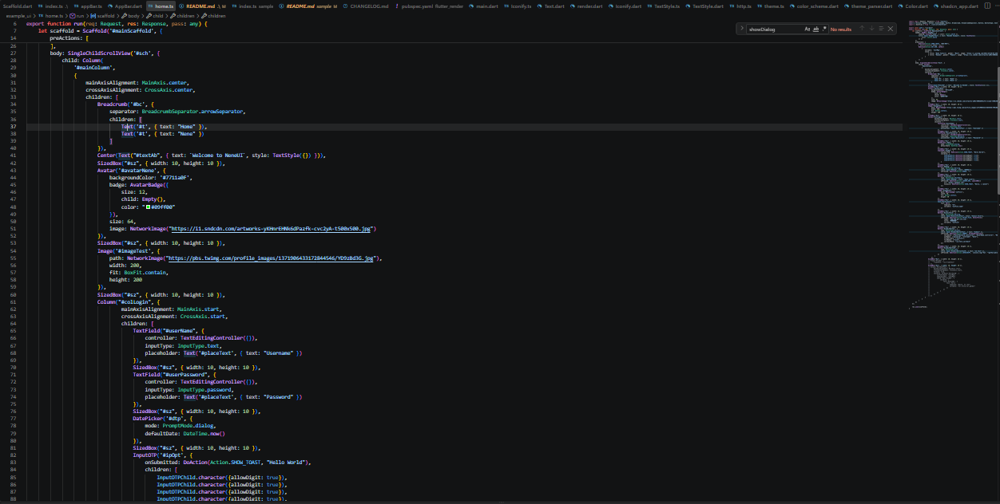
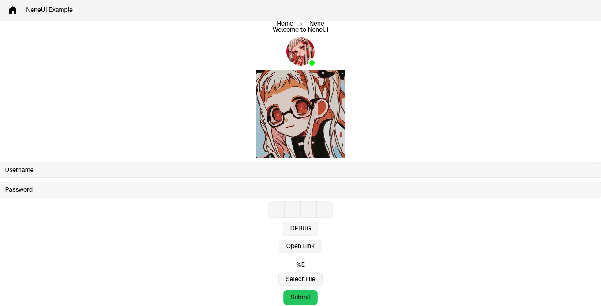

<p align="center">
  
</p>

# Nene UI Runtime

Build Flutter interfaces dynamically from a JavaScript server.

## Features

- Server-driven UI
- JavaScript backend
- Flutter rendering
- Dynamic widgets

| Server-Side Code | Rendered UI |
|:---:|:---:|
|  |  |
| *Server-Side Code* | *Rendered UI* |

## Getting Started

# Requirements
- Flutter SDK (3.38.6 or above)
- Bun.sh 1.3.x
- JavaScript & Dart Knowledge obv

## Getting Started With an Sample

Clone the Sample Repo
```bash
git clone https://github.com/kwe26/neneui-sample.git sample
```

### Install The Packages For Bun and Flutter

```bash
cd sample && bun install
```

```bash
cd flutter_app && flutter pub get
```

### Run the Server
```bash
bun run index.ts
```

### Run The Flutter App
> The Backend must be running at localhost:3500 or you can change it too.
> Recommended Platforms: Windows, Linux, Android only! (Not tested with Web, macOS, iOS)
```bash
flutter run
```

### Tweaking
`sample/example_ui/home.ts`
*You can modify the UI and Add More Widgets and test the Library*

# Test Library

```bash
cd ./flutter_render/example && flutter run -d
```

# Links & Credits
- [Documented Widgets](docs/Widgets.md)
- [Sample App](https://github.com/kwe26/neneui-sample)
- [shadcn_ui Flutter used for UI Components](https://github.com/sunarya-thito/shadcn_flutter)