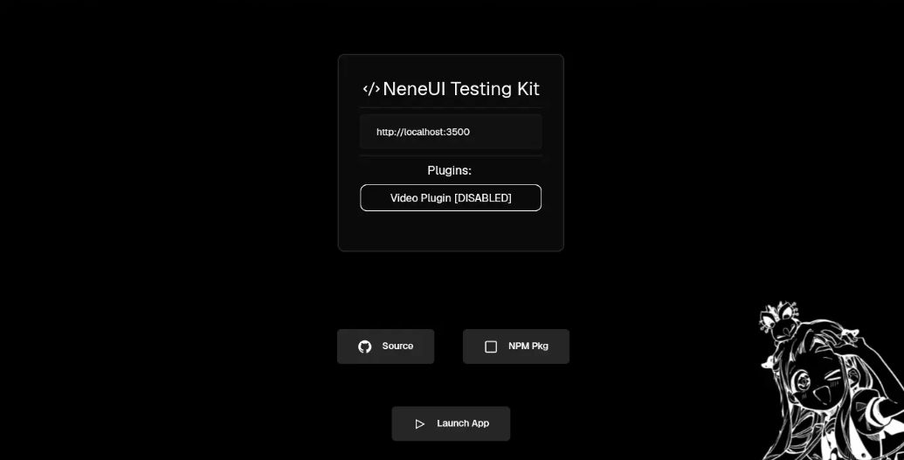

# NeneUI Testing Kit

> Cannot Or Don't wan to Compile to Test How your Server Side Rendered App Looks Like?

**WE HAVE A SOLUTION!!!** And it's Super Easyyy!

Head Over to <a href="https://github.com/kwe26/neneui/releases">Github Releases</a> of NeneUI!

And Download the `nene-tester` And From the Releases Download the Suitable OS Archive.

# How it looks :3

> It is/will be available for all the platforms that could be compiled!

Click on [Launch App] And gooo!!!