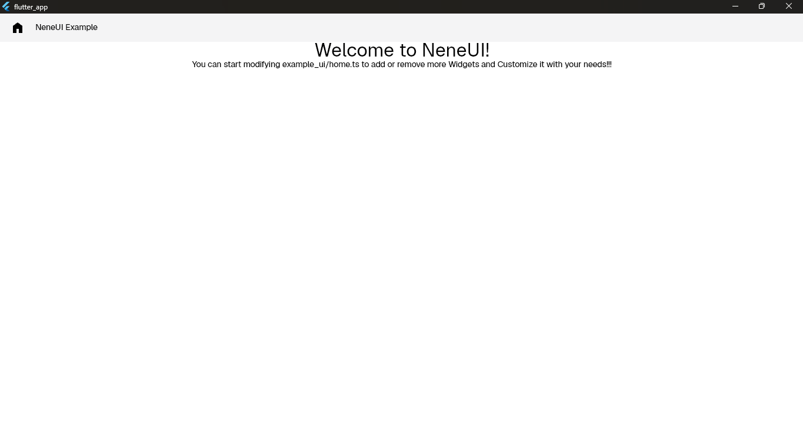

import Tabs from '@theme/Tabs';
import TabItem from '@theme/TabItem';

# Setup Client Side Interface

:::info
Only Flutter is Supported as of now for Client-Side Integrations
:::

## Initialize the Flutter Project

```bash
flutter create my_project --platforms=android,ios,linux,macos
```

## Install the Plugin

<Tabs>
  <TabItem value="pubspecyml" label="pubspec.yaml" default>
    Add This in dependencies:
    ```yaml
    dependencies:
      flutter:
        sdk: flutter

      neneui_render: ^0.0.6
    ```
  </TabItem>
  <TabItem value="pubdev" label="pub">
    ```yaml
    flutter pub add neneui_render
    ```
  </TabItem>
</Tabs>

## Create the File

<Tabs>
  <TabItem value="maindart" label="main.dart" default>
    ```dart
    import 'package:flutter/material.dart';
    import 'package:neneui_render/neneui_render.dart';

    void main() {
      runApp(const MyApp());
    }

    class MyApp extends StatelessWidget {
      const MyApp({super.key});

      @override
      Widget build(BuildContext context) {
        return InitUI.init(
          baseUrl: "http://localhost:3500",
          title: "Nene",
          plugins: {},
          debugShowCheckedModeBanner: false,
        );
      }
    }
    ```
  </TabItem>
</Tabs>

## Let's Run IT!!

<Tabs>
  <TabItem value="Windows" label="Windows" default>
    ```bash
    flutter run -d windows
    ```
  </TabItem>
  <TabItem value="Linux" label="Linux" default>
    :::info
    Make sure GTK Dependencies are installed for the flutter applications to run in Linux Platform.
    :::
    ```bash
    flutter run -d linux
    ```
  </TabItem>
  <TabItem value="iOS" label="iOS" default>
    :::info
    iOS does not require a separate Internet permission.

    If your backend uses **HTTPS**, no additional configuration is required.

    For a local development server using **HTTP**, you may need to configure
    App Transport Security (ATS) in `ios/Runner/Info.plist`.
    

    ```xml
    <key>NSAppTransportSecurity</key>
    <dict>
      <key>NSAllowsArbitraryLoads</key>
      <true/>
    </dict>
    ```
    :::
    ```bash
    flutter run
    ```
    _Flutter will ask_
  </TabItem>
  <TabItem value="Android" label="Android" default>
    :::info
    You must specify Internet Permission in the Android App Manifest
    ```xml
    <manifest xmlns:android="http://schemas.android.com/apk/res/android">
      <uses-permission android:name="android.permission.INTERNET"/>
      ....
    </manifest>
    ```
    :::
    ```bash
    flutter run
    ```
    _Flutter will ask the device to run automatically!_
  </TabItem>
</Tabs>

## TADA!



_We successfully did it_
Here say : **BANZAIII KASHIRAAA!!!**